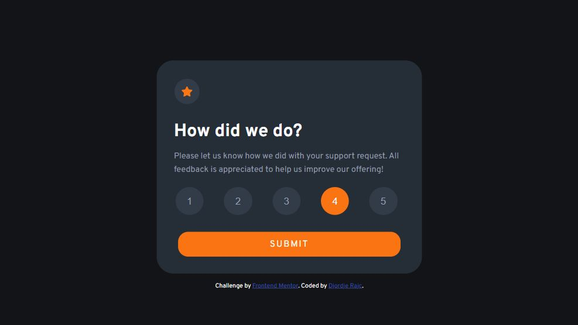

# Frontend Mentor - Interactive rating component solution

This is a solution to the [Interactive rating component challenge on Frontend Mentor](https://www.frontendmentor.io/challenges/interactive-rating-component-koxpeBUmI). Frontend Mentor challenges help you improve your coding skills by building realistic projects. 

## Table of contents

- [Overview](#overview)
  - [The challenge](#the-challenge)
  - [Screenshot](#screenshot)
  - [Links](#links)
- [My process](#my-process)
  - [Built with](#built-with)
  - [What I learned](#what-i-learned)
  - [Continued development](#continued-development)
  - [Useful resources](#useful-resources)
- [Author](#author)

**Note: Delete this note and update the table of contents based on what sections you keep.**

## Overview

### The challenge

Users should be able to:

- View the optimal layout for the app depending on their device's screen size
- See hover states for all interactive elements on the page
- Select and submit a number rating
- See the "Thank you" card state after submitting a rating

### Screenshot



### Links

- [Solution URL](https://www.frontendmentor.io/solutions/interactive-rating-component-WfJ0nNy5ud)
- [Live Site URL](https://interactive-rating-component-o7hqneeie-blurryface1998.vercel.app/)

## My process

### Built with

- CSS custom properties
- Mobile-first workflow
- [React](https://reactjs.org/) - JS library

### What I learned

I have learned how to make an array of button elements in React and loop through them using .map() so I can add a new class when you click on the button. Also i have learned how to store input from those buttons in local sotrage and implemenitg thath value in another page. And I have leraned how to set up browser router so when you click on a link it will have a page name thaht you are on using react-router-dom.

To see how you can add code snippets, see below:

```js
 const [count, setCount] = useState("0");

  const getButtonNameValue = (event) => {
   setCount(event.target.name);
  };
  
  localStorage.setItem("Key", count);
```

```js
  {buttons.map((item, index) => (
    <button 
      key={index}
      name={item} 
      onClick={(event) => handleClick(event, index)}
      className={index === active ? "numbers active" : "numbers"}>{item}</button>
  ))}
```

```js
<BrowserRouter>
  <Routes>
    <Route index element={<App  />}  />
    <Route path='ThankYouPage' element={<ThankYou />} />
  </Routes>
</BrowserRouter>
```

### Continued development

This is my first React app so I will continue practicing how to loop through JSX elements because It was a little harder because I had never done it like this before, and also I will practice more how to write a cleaner and reusable React code.

### Useful resources

- [Example resource](https://dev.to/ramonak/react-how-to-create-a-custom-button-group-component-in-5-minutes-3lfd) - This Helped me with writing and maping multiple buttons in React.

## Author

- Website - [Djordje Rajc]
- Frontend Mentor - [@Blurryface1998](https://www.frontendmentor.io/profile/Blurryface1998)